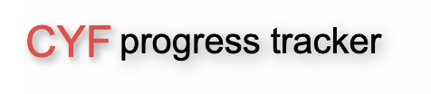
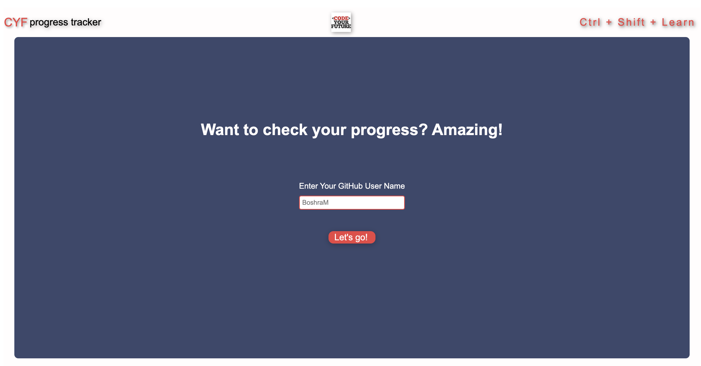
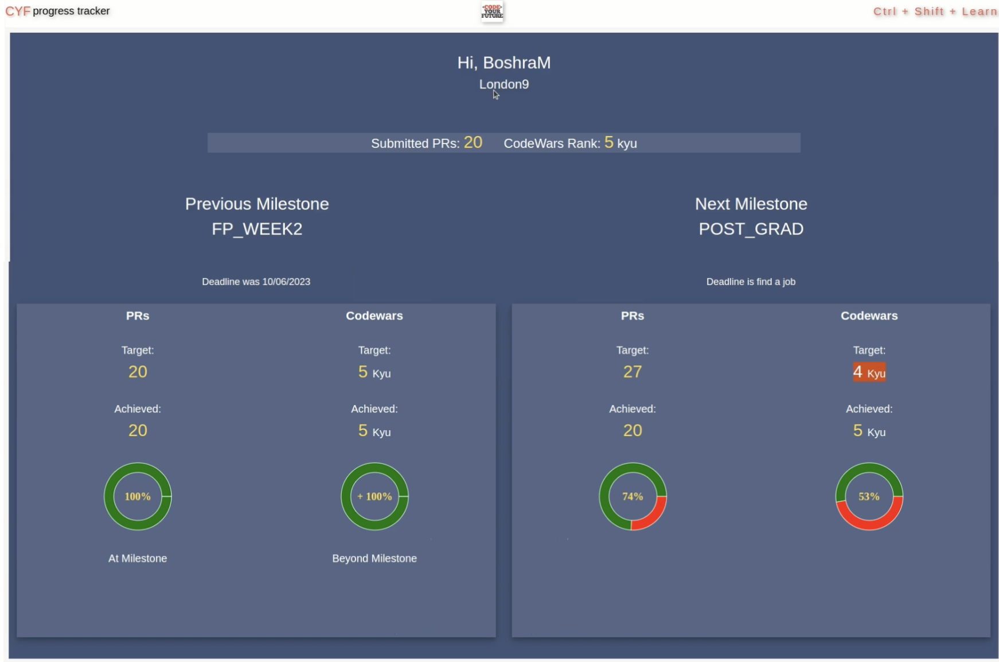
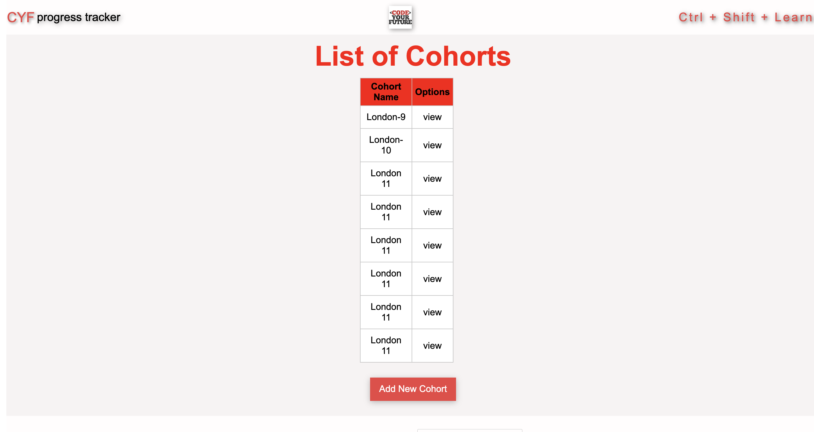
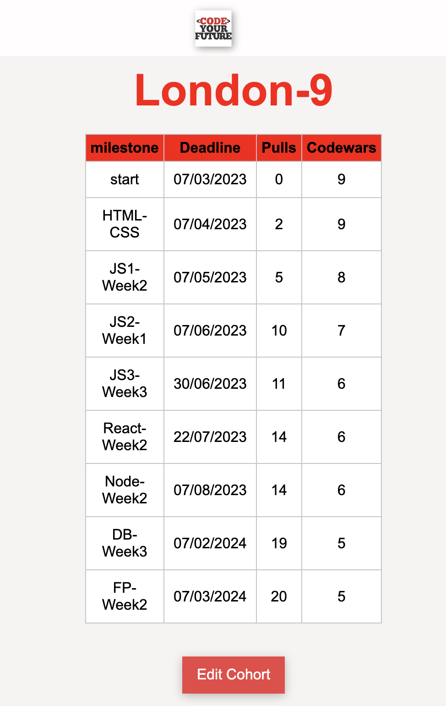
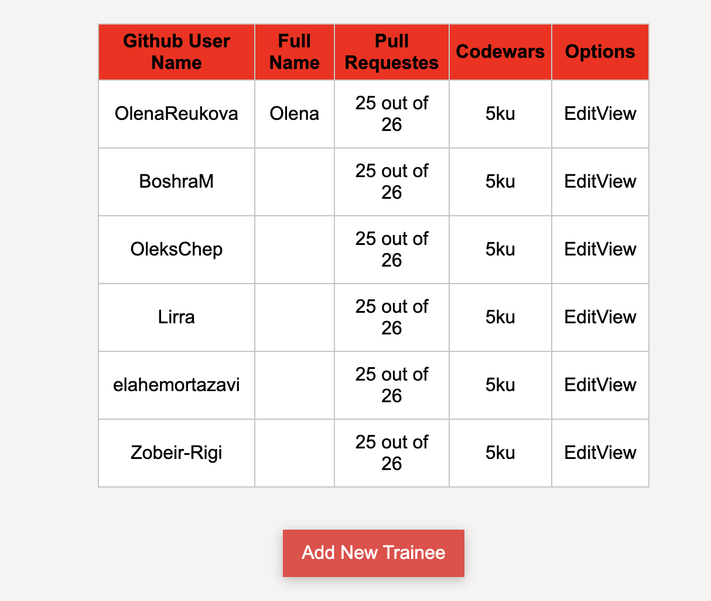
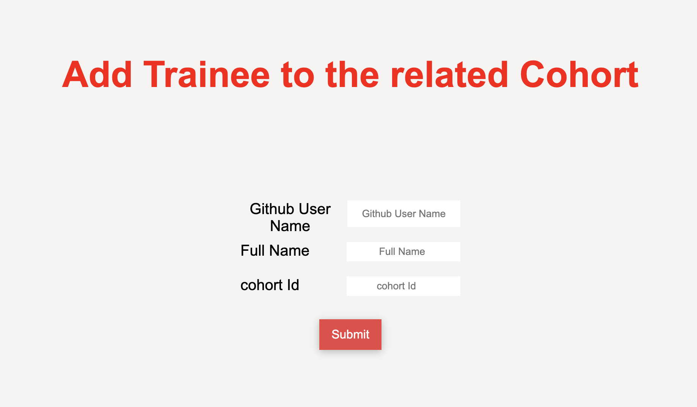

# CYF Progress Tracker


## Table of Contents
[`Introduction`](#introduction)    
[`Features`](#features)    
[`Getting Started`](#getting-started)    
[`Tech Stack`](#tech-stack)    
[`Dependencies`](#dependencies)    
[`Contributors`](#contributors)    


## Introduction
The CYF Progress Tracker is a web application designed to help trainees at CodeYourFuture (CYF) overcome the challenges of tracking their progress toward key milestones throughout their course. Recognizing the difficulty trainees face in monitoring their advancement, this application provides a centralized platform where they can easily track their progress against the milestones set by the Course Director.

## Features
### Trainee Progress Tracker
The application integrates with external platforms such as Codewars and GitHub to fetch data related to the trainees' activities. By displaying this data within the app, trainees can view their progress against milestones without the need for manual updates. This integration ensures that progress information is consistently updated and accessible, providing a clear overview of trainees' achievements and activities.

#### Home page


Home page displays the enter field for trainee.

#### Trainee Dashboard

 

The trainee dashboard provides trainees with essential information, including their cohort, the names of their previous and upcoming milestones, and the deadlines for each milestone. For each milestone, it displays the target number of pull requests (PRs) and the number of PRs achieved, the target Codewars rank and the achieved rank, and for both PRs and Codewars, a conclusion on whether the trainee is on track with the milestone or falling behind.

Using the collected data, the app assesses trainees' progress toward predefined milestones. This feature provides both trainees and the Course Director with a clear overview of where each trainee stands in their learning journey.

The application empowers trainees to monitor their own progress, identify areas where they need to improve, and work more effectively towards achieving their goals.

### Manager Dashboard
 

 
  
  
This app includes an admin dashboard for managers, allowing them to view cohorts, add new cohorts, edit existing cohorts, set milestones, and add trainees.

## Getting Started

To use the app, follow these steps:

Clone the repository.
Install the dependencies by running 
```npm install```

Start the development server by running
```npm run dev```


## Tech Stack
- [x] Full stack ES8+ with [Babel]
- [x] [Node] LTS support (verified working on 16.x, 18.x and 20.x LTS releases)
- [x] [Express] server
- [x] Logging with [Winston] and [Morgan]
- [x] [React] client with [Webpack]
- [x] Client-side routing with [React Router]
- [x] Linting with [ESLint] and [Prettier]
- [x] Dev mode (watch modes for client and server, proxy to avoid CORS issues)
- [x] Production build (single deployment artifact, React loaded via CDN)
- [x] [Render] deployment
- [x] [Cloud Foundry] deployment
- [x] [Docker] build
- [x] [Postgres] database with [node-postgres]

## Dependencies
 "@babel/runtime": "^7.21.5",    
		"dotenv": "^16.0.3",    
		"express": "^4.18.2",    
		"helmet": "^6.1.5",    
		"morgan": "^1.10.0",    
		"node-pg-migrate": "^6.2.2",    
		"pg": "^8.11.1",    
		"recharts": "^2.7.2",    
		"winston": "^3.8.2"    
    
  ## Contributors
1. Olena Reukova - [`Link`](https://github.com/OlenaReukova)
2. Boshra Mahmoudi - [`Link`](https://github.com/BoshraM)
3. Zober Rigi - [`Link`](https://github.com/Zobeir-Rigi)
4. Mohammad Sefidgar- [`Link`](https://github.com/MohammadSefidgar)
      
